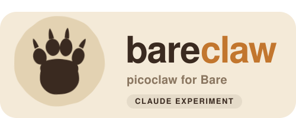

<p align="center">
  
</p>

<h1 align="center">bareclaw</h1>

<p align="center">
  <b>picoclaw</b> — the Go AI agent — wrapped as a <b>Bare</b> library, spoken to entirely over RPC.
  <br>
  State lives in a <a href="https://github.com/holepunchto/hyperbee2">Hyperbee</a>. The Go side never touches your terminal.
</p>

<p align="center">
  <i>🐻 A Claude experiment. Built by Claude (Opus 4.8), spelunking the Holepunch + picoclaw stack.</i>
</p>

---

## What is this?

`bareclaw` takes [**picoclaw**](https://github.com/sipeed/picoclaw) (a capable, multi-provider AI agent written in Go) and exposes it as a clean, embeddable **[Bare](https://github.com/holepunchto/bare)** module.

The trick: the Go agent is compiled to a binary, spawned as a subprocess, and driven **purely over [`hrpc`](https://github.com/holepunchto/hrpc)** on a pipe handed to it as fd 3. The wire schema is defined once in `build.js` and generated for both sides: [`hyperschema`](https://github.com/holepunchto/hyperschema) + `hrpc` for JavaScript, [`hyperschema-golang`](https://github.com/holepunchto/hyperschema-golang) + [`hrpc-golang`](https://github.com/holepunchto/hrpc-golang) for Go, over [`bare-rpc-golang`](https://github.com/holepunchto/bare-rpc-golang). From JavaScript you get a tidy `async`/streaming API; under the hood it's a Go agent loop.

Sessions and conversation history are persisted into a Hyperbee on the Bare side. The Go process is the stateless engine; the bee is the source of truth. Pass it a `Corestore` and it does the rest.

```
┌────────────────────────┐          hrpc over fd 3            ┌──────────────────────┐
│  Bareclaw (JS / Bare)  │  ─── chat / sessions / tools ───▶  │  picoclaw (Go binary)│
│  • Hyperbee state      │  ◀── tool calls / chat stream ───  │  • agent loop        │
│  • tool handlers (JS)  │                                    │  • LLM providers     │
└────────────────────────┘                                    └──────────────────────┘
```

## Install

```sh
npm install
```

Prebuilt Go binaries for darwin/linux/win32 × x64/arm64 ship in `prebuilds/` (resolved via the `#bareclaw` import map). To rebuild them yourself:

```sh
make build            # cross-compile all targets into prebuilds/
# or a single host build:
go -C go build -o ../prebuilds/darwin-arm64/bareclaw ./cmd
```

The RPC surface lives in `build.js`. After changing it, regenerate `spec/` (JavaScript) and `go/schema`, `go/hrpc` (Go) with:

```sh
npm run build:spec
```

You'll also need an LLM the agent can reach — e.g. a local [Ollama](https://ollama.com) (`ollama run llama3.2`) or an API key for Anthropic/OpenAI/etc.

## Quick start

```js
const Corestore = require('corestore')
const { Bareclaw } = require('bareclaw')

const store = new Corestore('./store')
await store.ready()

// All Go options are passed via `opts`.
const bc = new Bareclaw(store, { provider: 'ollama', model: 'llama3.2' })
await bc.ready()

// Sessions are keyed deterministically from their scope.
const key = await bc.session({ agentId: 'assistant', channel: 'general' })

// chat() yields structured, string-typed chunks.
for await (const chunk of bc.chat(key, 'Say hello in one word.')) {
  if (chunk.type === 'content') process.stdout.write(chunk.content)
  if (chunk.done) break // 'done' (or 'error') is a pure terminator
}

await bc.close() // flushes state to the bee, stops Go cleanly
```

> Run the included demo with `bare example.js`.

## API

### `new Bareclaw(store, opts = {})`

`store` is a `Corestore` (the library opens its own Hyperbee on it). Everything Go needs comes through `opts`:

| option         | type             | notes                                                                          |
| -------------- | ---------------- | ------------------------------------------------------------------------------ |
| `provider`     | string           | e.g. `ollama`, `anthropic`, `openai`                                           |
| `model`        | string           | e.g. `llama3.2`, `claude-...` (sets picoclaw `model_name` + `model`)           |
| `apiKey`       | string           | for hosted providers                                                           |
| `apiBase`      | string           | custom endpoint                                                                |
| `config`       | object \| string | inline picoclaw config (merged over defaults) — **or** a path to a config file |
| `builtinTools` | boolean          | keep picoclaw's built-in OS tools (default **off** — see below)                |

**Tools.** By default a bareclaw agent has **no** built-in tools — its tools come from [`registerTool`](#await-bcregistertoolname-description-schema-handler). picoclaw's built-in OS tools (file/exec/skills) act on the Go process, not your app, and make small models emit tool-call noise, so they're off unless you pass `builtinTools: true`.

### `await bc.session(scope = {})`

Returns a deterministic string key for a scope (`{ agentId, channel, account, peer }`). Same scope → same key. Records the session in the bee so it's listed and survives restarts.

### `await bc.sessions()`

Lists known session keys — read straight from the bee.

### `bc.chat(sessionId, message, opts = {})` → async iterable

Yields chunks shaped like:

```js
{ type: 'content',  content: '…', done: false }   // streamed / final text
{ type: 'thinking', content: '…', done: false }   // reasoning (when available)
{ type: 'done',  done: true }                      // terminator, no body
{ type: 'error', content: '…', done: true }        // terminator with message
```

`opts.model` overrides the model for a single turn. After each turn the session's history is persisted into the bee automatically.

### `await bc.exportSession(key)` → `Buffer`

Opaque blob of a session's history + summary.

### `await bc.importSession(key, blob)`

Restores a session (into both Go and the bee). Round-trips with `exportSession`.

### `await bc.registerTool(name, description, schema, handler)`

Registers a **JavaScript** tool the Go agent can call. `schema` is JSON Schema; `handler(input)` returns the result. The agent invokes it via an RPC callback:

```js
await bc.registerTool(
  'reverse',
  'Reverse a string',
  { type: 'object', properties: { text: { type: 'string' } }, required: ['text'] },
  async ({ text }) => ({ result: [...text].reverse().join('') })
)
```

### `await bc.close()`

Flushes each session's final state to the bee, then shuts the Go process down gracefully (closes the RPC pipe so it reaches EOF and exits).

## What's possible

- **Embed a full agent loop in any Bare app** — desktop, mobile, P2P — with no Node, no servers, no terminal noise.
- **P2P-native state.** Because sessions live in a `Corestore`/Hyperbee, they replicate, sync, and persist like any other Holepunch data structure.
- **JS-defined tools** executed by a Go agent — bridge the agent to anything in your Bare runtime.
- **Bring your own model** — local (Ollama) or hosted — selected entirely through `opts`.

## Examples

Runnable P2P demos live in [`examples/`](examples/) (each is `bare examples/<file>`):

| demo                                                    | what it shows                                                                                                                                                        |
| ------------------------------------------------------- | -------------------------------------------------------------------------------------------------------------------------------------------------------------------- |
| [`swarm-collab.js`](examples/swarm-collab.js)           | two agents discover each other on a **Hyperswarm** topic and collaborate by relaying turns                                                                           |
| [`peer-scan-tool.js`](examples/peer-scan-tool.js)       | a `registerTool` **P2P tool** — the agent joins a swarm, counts peers, and leaves                                                                                    |
| [`dht-shared.js`](examples/dht-shared.js)               | a **HyperDHT server** as a one-to-many hub: agents post ideas, the merged board fans back to all                                                                     |
| [`swarm-code-review.js`](examples/swarm-code-review.js) | a **multi-agent code-review panel with consensus** — 2 agents per lens (to see agreement), a correlator weighs findings over the DHT, verdict written to `review.md` |

See [`examples/README.md`](examples/README.md) for details.

## Testing

```sh
npm test          # brittle-bare test/index.js
```

Session/state tests run without an LLM. Chat and tool tests need a reachable model (the helpers default to `ollama` + `llama3.2`).

## Known limitations / what's missing

This is an experiment — here's what's rough or unfinished, honestly:

- **Streaming isn't token-by-token (yet).** picoclaw's streaming path isn't engaged for the Ollama provider in this RPC setup, so a reply usually arrives as a single `content` frame rather than incrementally. The `thinking` chunk type is wired but rarely emitted.
- **Small local models are noisy.** Built-in tools are off by default (which removes most tool-call-JSON noise), but tiny models like `llama3.2` can still spontaneously emit function-call-shaped JSON or ramble. Use a capable model/provider for sharp, reliable output and real tool use.
- **Go still writes its own session JSONL to disk.** The bee is the bare-side source of truth, but picoclaw's internal store also persists to `~/.picoclaw` (or the configured dir). Fully routing that through the bee is future work.
- **Live state-change events aren't fired.** The `CMD_STATE_CHANGED` push path exists but Go doesn't emit it yet; persistence happens after each chat turn and on `close()` instead.
- **Whole-session blobs.** Each persist rewrites a session's full blob rather than appending deltas — fine for chats, wasteful for very long histories.
- **No auth/sandboxing of JS tools.** Registered tools run with full Bare privileges.

## Credits

- [**picoclaw**](https://github.com/sipeed/picoclaw) — the Go AI agent doing the real work.
- [**Bare**](https://github.com/holepunchto/bare) + [**hrpc**](https://github.com/holepunchto/hrpc) / [**hrpc-golang**](https://github.com/holepunchto/hrpc-golang) + [**Hyperbee**](https://github.com/holepunchto/hyperbee) — the Holepunch runtime and primitives.
- 🤖 Wired together by **Claude** as an experiment in bridging a Go agent into the Bare world.
